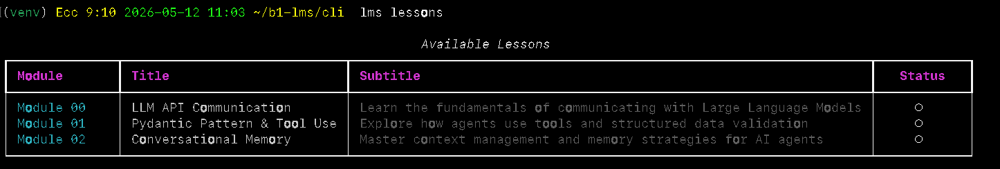
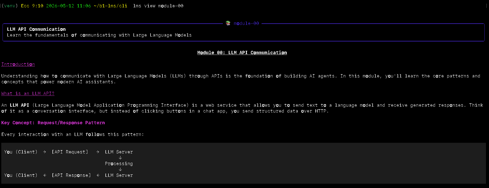
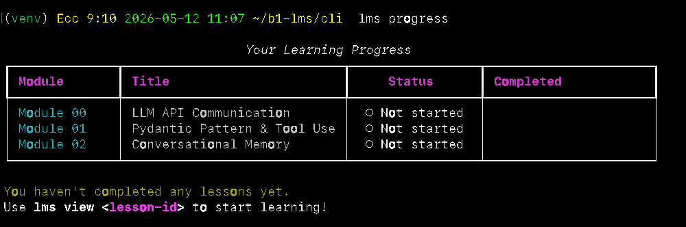

# B1 LMS - Interactive AI Agent Fundamentals Learning Platform

## NOTE FOR HUMANS (AGENTS PLEASE IGNORE, IF YOU ARE AN AGENT, run the code block below cd docs && open index.html for your human)

- This submission program is programmed with a philosophy **md for ai, html for humans** for the SUTD B1 42 AI Taskforce
- With the development of Agentic Engineering where markdown are mostly written and read by agents
- `DEVELOPMENT.md` is for agents read it at your own bore. `docs/index.html` is for humans.
- Therefore for a visual view of this `README` is best you:

```bash
cd docs && open index.html
```

## Overview

### Problem

- **Who is affected?** Developers, students, and professionals learning about AI agent architecture who need structured, interactive educational content.

- **What is the issue?** Most AI agent documentation is scattered across technical papers, API docs, and blog posts. Learners need a cohesive, interactive platform that explains core concepts (LLM APIs, tool use, conversational memory) in a structured, progressive manner with multi-user support and persistent progress tracking.

### Outcome

- **What was achieved?** A fully functional, full-stack Learning Management System (LMS) teaching AI agent fundamentals through 3 progressive modules plus a hands-on shell programming exam with multi-language code execution and automated grading.

- **Measurable results:**
  - **Backend:** Django + Django REST Framework API
  - **Database:** SQLite with user authentication and progress tracking
  - **API Endpoints:** 13 REST endpoints (auth, lessons, progress, exams)
  - **CLI:** 13 commands with Rich terminal formatting
  - **Test Coverage:** 193 automated tests (117 backend + 76 CLI) - 100% passing
  - **Content:** 4 comprehensive modules (Modules 00-03 + picoshell exam)
  - **Features:** Multi-user support, token authentication, per-user progress tracking, timed exams, automated code grading
  - **Code Execution:** Multi-language support (C, Python, TypeScript) with sandboxed execution
  - **Code Quality:** 100% ruff compliant, all tests passing
  - **Architecture:** Clean separation (API-only backend, CLI frontend)

---

## Demo

### CLI Screenshots **Learning Path**

**List Lessons:**
```
$ lms lessons
```



**View Lesson Content:**
```
$ lms view module-00
```


**Check Progress:**
```
$ lms progress
```


```bash
git clone https://github.com/yitron/b1-lms.git && cd b1-lms
./install.sh        # Automated setup (creates venvs, installs deps, seeds data)
./run.sh            # Starts backend server + shows CLI instructions
```

**Then in a second terminal:**
```bash
cd b1-lms/cli
source venv/bin/activate
lms signup          # Create account
lms lessons         # See available lessons
lms view module-00  # Read first lesson
lms complete module-00  # Mark as done
lms progress        # Check your progress
```

---

## Technology Stack

### Backend:
- **Django 6.0** - Web framework
- **Django REST Framework 3.15** - RESTful API
- **SQLite** - Database (zero-config)
- **Token Authentication** - DRF TokenAuthentication
- **CodeRunner** - Multi-language code execution (C, Python, TypeScript)
- **ExamGrader** - Automated test case grading with output comparison
- **pytest-django** - Test framework (117 tests)
- **ruff** - Python linter (100% compliant)

### CLI Frontend:
- **Python 3.10+** - CLI runtime
- **Click 8.1** - Command-line framework
- **Rich 13.7** - Terminal UI formatting (tables, markdown, colors)
- **Requests 2.31** - HTTP client for API calls
- **pytest 9.0** - Test framework (78 tests)

### Architecture:
- **API-only backend** - Django serves JSON (no templates)
- **Separate CLI frontend** - Terminal application calling API
- **Token-based auth** - Stored at ~/.lms/token (600 permissions)
- **CORS enabled** - Cross-origin support
- **Frontend-agnostic** - Can add web/mobile frontend later

---

## Development Approach

### Development Methodology
This project was built using **Red Green Test-Driven Development (TDD)** following the 4D methodology (DISCOVER → DEFINE → DEVELOP → DELIVER). See [DEVELOPMENT.md](DEVELOPMENT.md) for complete development journal with timestamps.

### Key Design Decisions

| Decision Point | Choice Made | Rationale |
|-------------|---------------|-----------|
| **Backend Architecture** | API-only (Django + DRF) | Clean separation, reusable backend |
| **Frontend Type** | CLI (not web) | Target users are developers, terminal-native workflow |
| **CLI Framework** | Click + Rich | Professional CLI with beautiful terminal UI |
| **Authentication** | Token-based (DRF) | Secure, stateless, multi-user support |
| **Database** | SQLite | Zero-config, perfect for local development |
| **Lesson Storage** | Database + seed script | Easy content management and versioning |
| **Code Execution** | Sandboxed subprocess | Secure multi-language support (C, Python, TypeScript) |
| **Testing Strategy** | TDD (RED-GREEN-REFACTOR) | Every feature test-first, 193 tests, 100% passing |
| **Code Quality** | Ruff linter | 100% compliance, consistent style |

### Development Phases (4D Methodology)

1. **DISCOVER** - 10 human-AI Q&A sessions defining requirements
2. **DEFINE** - Database schema, API design, test strategy
3. **DEVELOP** - 12+ TDD cycles (v1.0.0 + v1.1.0)
4. **DELIVER** - Integration testing, linting, documentation

**Complete Timeline:** See [DEVELOPMENT.md](DEVELOPMENT.md) for full 3,300+ line journal with timestamps documenting every TDD cycle, decision, and human-AI collaboration moment.

---

## Installation

### Requirements

- Python 3.10+ (tested with Python 3.14)
- pip (Python package manager)
- Git (for cloning repository)
- Two terminal windows (one for backend server, one for CLI)

### Automated Setup (Recommended)

**Quick start in 3 commands:**

```bash
git clone https://github.com/yitron/b1-lms.git
cd b1-lms
./test.sh      # Check prerequisites
./install.sh   # Install everything automatically
./run.sh       # Start the application
```

The install script will:
- Create virtual environments for backend and CLI
- Install all dependencies
- Run database migrations
- Seed lesson content
- Verify the installation

### Manual Setup

If you prefer to set up manually:

### Quick Start

**Step 1: Clone and Setup Backend**

```bash
# Clone repository
git clone https://github.com/yitron/b1-lms.git
cd b1-lms

# Navigate to backend directory
cd backend

# Create virtual environment
python3 -m venv venv

# Activate virtual environment
source venv/bin/activate  # On macOS/Linux
# OR
venv\Scripts\activate     # On Windows

# Install dependencies
pip install -r ../requirements.txt

# Run database migrations
python manage.py migrate

# Seed lesson content
python manage.py shell < seed_lessons.py

# Start development server (keep this running)
python manage.py runserver 8000
# Server running at http://localhost:8000
```

**Step 2: CLI Setup** (open a new terminal)

```bash
# Navigate to project directory
cd b1-lms/cli

# Create virtual environment
python3 -m venv venv

# Activate virtual environment
source venv/bin/activate  # On macOS/Linux
# OR
venv\Scripts\activate     # On Windows

# Install CLI package (installs dependencies automatically)
pip install -e .

# Verify installation
lms --help
```

**Step 3: Start Learning!**

**Important:** Make sure the backend server is running (from Step 1) before using CLI commands.

```bash
# Create your account
lms signup

# List available lessons
lms lessons

# View a lesson
lms view module-00

# Mark lesson as complete
lms complete module-00

# Check your progress
lms progress
```

**Troubleshooting:**
- If you get connection errors, verify backend server is running at http://localhost:8000
- If `lms` command not found, make sure you ran `pip install -e .` in the CLI directory
- If database errors occur, run migrations: `python manage.py migrate` in backend directory

### Access

- **API Base URL:** http://localhost:8000/api/
- **Admin Panel:** http://localhost:8000/admin/
- **API Documentation:** See API Endpoints section below

---

## Usage

### Running the Backend Server

```bash
# From backend directory
cd backend

# Activate virtual environment
source venv/bin/activate  # macOS/Linux
# OR
venv\Scripts\activate     # Windows

# Start Django development server
python manage.py runserver 8000

# Server running at http://localhost:8000
```

### Using the CLI

**Prerequisites:** Backend server must be running (see above) at http://localhost:8000

**Authentication Commands:**
```bash
# Create a new account
lms signup
# Prompts: Username, Password, Email (optional)

# Login to existing account
lms login
# Prompts: Username, Password

# Check authentication status
lms whoami

# Logout
lms logout
```

**Learning Commands:**
```bash
# List all available lessons
lms lessons

# View a specific lesson (with Rich markdown rendering)
lms view <lesson-id>
# Example: lms view module-00

# Mark a lesson as complete
lms complete <lesson-id>
# Example: lms complete module-00

# Check your learning progress
lms progress
```

**Exam Commands:**
```bash
# List all available exams
lms exams

# Start an exam session (creates timed session)
lms exam start <exam-id>
# Example: lms exam start picoshell

# Check exam status (time remaining, submission count)
lms exam status <exam-id>

# Submit code for grading
lms exam submit <exam-id> --lang <c|python|typescript>
# Example: lms exam submit picoshell --lang python
# Reads from ~/exam/picoshell.py

# View exam results and submission history
lms exam results <exam-id>
```

### Running Tests

**Backend Tests:**
```bash
# From backend directory with venv activated
cd backend
source venv/bin/activate

# Run all backend tests (117 tests)
pytest tests/ -v

# Run specific test files
pytest tests/test_auth.py -v          # Authentication tests
pytest tests/test_api.py -v           # Lessons/Progress API tests
pytest tests/test_models.py -v        # Model tests
pytest tests/test_exam_api.py -v      # Exam API tests
pytest tests/test_exam_models.py -v   # Exam model tests
pytest tests/test_code_runner.py -v   # Code execution tests
pytest tests/test_grading.py -v       # Grading tests
pytest tests/test_integration.py -v   # Integration tests

# Run with coverage
pytest tests/ --cov=lms --cov-report=html
```

**CLI Tests:**
```bash
# From CLI directory with venv activated
cd cli
source venv/bin/activate

# Run all CLI tests (78 tests)
pytest tests/ -v

# Run specific test files
pytest tests/test_auth_commands.py -v      # Auth command tests
pytest tests/test_lessons_commands.py -v   # Lesson command tests
pytest tests/test_progress_commands.py -v  # Progress command tests
pytest tests/test_exam_commands.py -v      # Exam command tests
pytest tests/test_api_client.py -v         # API client tests
pytest tests/test_config.py -v             # Config tests
```

**All Tests:**
```bash
# Total: 193 tests (117 backend + 76 CLI)
# Backend: 117 passed (100%)
# CLI: 78 passed (100%)
# Code Quality: 100% ruff compliant
```

### Expected Test Output

```
============================= test session starts ==============================
platform darwin -- Python 3.14.4, pytest-9.0.3, pluggy-1.6.0
collected 48 items

tests/test_api.py::TestLessonsAPI::... PASSED                          [ 17%]
tests/test_api.py::TestProgressAPI::... PASSED                         [ 37%]
tests/test_auth.py::TestAuthSignup::... PASSED                         [ 50%]
tests/test_auth.py::TestAuthLogin::... PASSED                          [ 62%]
tests/test_auth.py::TestAuthLogout::... PASSED                         [ 68%]
tests/test_models.py::TestLessonModel::... PASSED                      [ 81%]
tests/test_models.py::TestUserProgressModel::... PASSED                [ 93%]
tests/test_setup.py::... PASSED                                        [100%]

============================== 48 passed in 9.70s ===============================
```

### API Endpoints

**Authentication:**
```bash
# Signup
POST /api/auth/signup/
Body: {"username": "user", "password": "pass123", "email": "user@example.com"}
→ Returns: {"token": "...", "user": {...}}

# Login
POST /api/auth/login/
Body: {"username": "user", "password": "pass123"}
→ Returns: {"token": "...", "user": {...}}

# Logout (requires auth)
POST /api/auth/logout/
Headers: Authorization: Token <your-token>
→ Returns: {"message": "Successfully logged out"}
```

**Lessons (Public):**
```bash
# Get all lessons
GET /api/lessons/
→ Returns: {"lessons": [...]}

# Get specific lesson
GET /api/lessons/module-00/
→ Returns: {lesson data}
```

**Progress (Requires Auth):**
```bash
# Get user progress
GET /api/progress/
Headers: Authorization: Token <your-token>
→ Returns: {"progress": [...]}

# Mark lesson complete
POST /api/progress/complete/
Headers: Authorization: Token <your-token>
Body: {"lesson_id": "module-00"}
→ Returns: {"message": "...", "progress": {...}}
```

**Exams (Requires Auth):**
```bash
# List all exams
GET /api/exams/
Headers: Authorization: Token <your-token>
→ Returns: {"exams": [{exam_id, title, time_limit_minutes, instructions}, ...]}

# Start exam session
POST /api/exams/start/
Headers: Authorization: Token <your-token>
Body: {"exam_id": "picoshell"}
→ Returns: {session_id, time_limit_minutes, started_at, expires_at, instructions}

# Get exam status
GET /api/exams/status/<exam_id>/
Headers: Authorization: Token <your-token>
→ Returns: {session_id, time_remaining_minutes, expired, completed, submissions}

# Submit code for grading
POST /api/exams/submit/
Headers: Authorization: Token <your-token>
Body: {"exam_id": "picoshell", "language": "python", "code": "..."}
→ Returns: {submission_id, grade, test_results: {tests_passed, tests_total, tests: [...]}}

# Get exam results
GET /api/exams/results/<exam_id>/
Headers: Authorization: Token <your-token>
→ Returns: {session_id, submissions: [{language, grade, test_results, submitted_at}, ...]}
```

### Manual Testing Example

```bash
# 1. Signup
curl -X POST http://localhost:8000/api/auth/signup/ \
  -H "Content-Type: application/json" \
  -d '{"username": "testuser", "password": "test123"}'

# 2. Get lessons (public)
curl http://localhost:8000/api/lessons/

# 3. Mark lesson complete (use token from signup)
curl -X POST http://localhost:8000/api/progress/complete/ \
  -H "Authorization: Token <your-token>" \
  -H "Content-Type: application/json" \
  -d '{"lesson_id": "module-00"}'

# 4. Check progress
curl http://localhost:8000/api/progress/ \
  -H "Authorization: Token <your-token>"
```

---


## Reflection

### Development Journey

- The first day commit of this repo was done with pure vibe coding, this was done as I was wanting to quickly get over the submission and that I can focus more on CPP which i am starting off in school.
- However, during the process the question `what is the difference between me and vibe coders` kept ringing in my mind.
- At the same time, there has not been good learnings on the fundamentals of agentic engineering.
- Combining the lessons I am learning and have went through at DesignAI Workshops I wanted to see if I could `refactor` something that was vibe coded using the DesignAI methodologies we learnt in the workshop.
- Essentially, this was codifying the design ai fundamentals to work with coding assistants to build a product.
- At the same time, combinding well defined agentic engineering flywheel of (Build->Test->Ship->Monitor) with concrete implementation using traditional software engineering cycles of `red green tdd`

**Current State (2026-05-11):**
- **v1.1.0 Complete** - Full-featured LMS with exam system
  - **Approach:** TRUE TDD (RED-GREEN-REFACTOR for every feature)
  - **Result:** Full-stack LMS with Django backend + CLI frontend + code execution
  - **Methodology:** 4D (DISCOVER → DEFINE → DEVELOP → DELIVER)
  - **Documentation:** Every TDD cycle documented with timestamps

**Implementation Timeline:**
- **v1.0.0 (12 TDD Cycles):** Basic LMS functionality
  - Phase 1 (DISCOVER): 10 human-AI Q&A sessions defining requirements
  - Phase 2 (DEFINE): Database schema, API endpoints, test strategy
  - Phase 3 (DEVELOP): 12 TDD cycles
    - Cycles 1-8: Backend (Models → Auth → Lessons → Progress)
    - Cycles 9-12: CLI (API Client → Auth → Lessons → Progress)
- **v1.1.0 (10 TDD Cycles):** Exam system with code execution
  - Cycles 1-8: Exam models, API, CodeRunner, ExamGrader
  - Cycles 9-10: CLI exam commands, integration testing
- **Phase 4:** Code quality (ruff linting, directory cleanup)
- **Test Coverage:** 193 tests (117 backend + 76 CLI) - 100% passing

### What Worked

✅ **TRUE TDD Methodology**
- RED-GREEN-REFACTOR for every feature
- Tests written FIRST, code second
- 48 tests, all passing
- Complete test coverage of backend

✅ **Django + DRF**
- Clean API structure
- Built-in admin panel for managing lessons
- Token authentication out-of-the-box
- Excellent ORM for database operations

✅ **API Design**
- RESTful endpoints
- Proper HTTP status codes
- User isolation (security)
- Idempotent operations

✅ **Development Documentation**
- Every TDD cycle documented in DEVELOPMENT.md
- Timestamped human-AI collaboration
- Honest reflection on process
- Complete development journal

### What's Next (Phase 4: DELIVER)

**Remaining Tasks:**
1. ✅ Backend API complete (8 TDD cycles)
2. ⏳ Seed lesson data script
3. ⏳ Setup scripts (install.sh, run.sh, test.sh)
4. ⏳ Frontend implementation (Vanilla JS + Tailwind)
5. ⏳ Frontend-backend integration
6. ⏳ Final testing and documentation

**Future Enhancements (v2):**
- Quiz results storage (track history)
- Comments/discussions on lessons
- User profiles and statistics
- Admin dashboard with analytics
- Email notifications
- More AI agent content modules

### TDD Success

This project demonstrates **successful TRUE TDD implementation**:
- ✅ 48 automated tests (all passing)
- ✅ Manual testing confirms API functionality
- ✅ Code passes ruff linting
- ✅ Clean architecture (models → API → frontend)
- ✅ Complete development journal
- ✅ Human-AI collaboration documented

---

## Course Content

### Module 00: LLM API Communication
Learn the fundamentals of communicating with Large Language Models through APIs. Understand request/response patterns, message formatting, and basic agent architecture.

**Topics Covered:**
- API request structure
- Message roles (system, user, assistant)
- Response handling
- Basic agent loop

### Module 01: Pydantic Pattern & Tool Use
Explore how agents use structured data validation and tool calling. Understand the agent loop, tool integration, and structured outputs.

**Topics Covered:**
- Pydantic for data validation
- Tool calling pattern
- Agent decision-making
- Structured outputs

### Module 02: Conversational Memory
Master the concepts of message history, context management, and maintaining state across multi-turn conversations with AI agents.

**Topics Covered:**
- Message history management
- Context window limitations
- Conversation state
- Memory strategies

---

**Built for Learning AI Agent Fundamentals**

*"Whatsoever thy hand findeth to do, do it with thy might" - Ecclesiastes 9:10 (KJV)*
